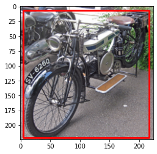
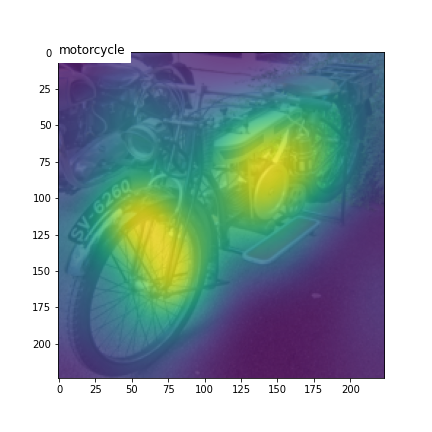
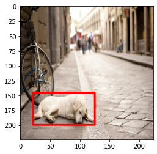
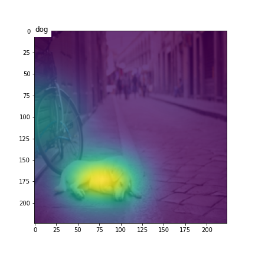
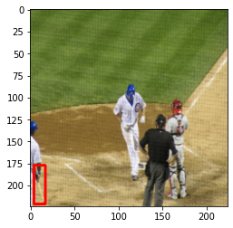
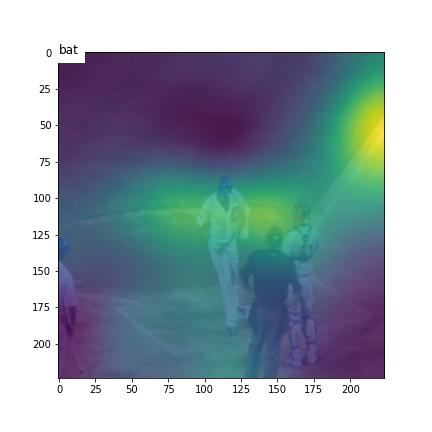
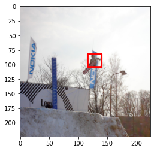
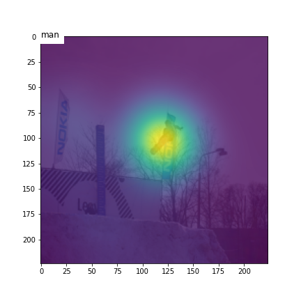
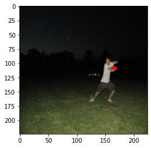
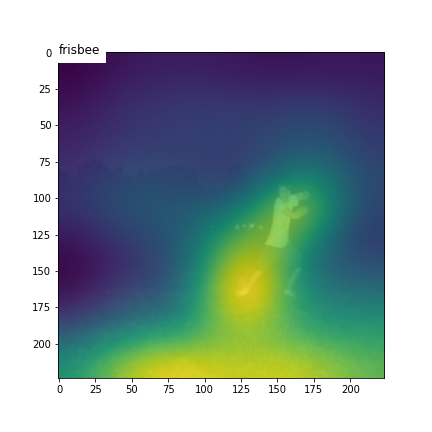

### Show attend and tell implementation

#### hyperparameters

vocabulary size = 22905

feature length = 196

embedding size = 512

attention size = 256

batch size = 64

During training  we have used scheduled sampling (select the previous predicted output instead of the ground truth output with probability 1-p)
##### BLEU Score
The Bilingual Evaluation Understudy Score, or BLEU, is a metric for evaluating a generated sentence to a reference sentence. The approach works by counting matching n-grams in the candidate sentence to n-grams in the reference text, where 1-gram or unigram would be each token and a bigram comparison would be each word pair. The comparison is made regardless of word order.
##### METEOR Score
Metric for Evaluation for Translation with Explicit Ordering, or METEOR, computes scores based on weighted F-score based on mapping unigrams and a penalty function for incorrect word order.

#### training score
| Encoder |Trained on | BLEU-1 | BLEU-2 | BLEU-3 | BLEU-4 | METEOR |
| ------- | --------  | ---- | ----- | ----- | ----- |  ----   |
| VGG19   |  COCO2014 | 69.6 | 52.3  |  37.8 | 27    | 23.6    |

#### validation score
| Encoder |Trained on | BLEU-1 | BLEU-2 | BLEU-3 | BLEU-4 | METEOR |
| ------- | --------  | ---- | ----- | ----- | ----- |  ----   |
| VGG19   |  COCO2014 | 67.0 | 49.1  |  34.6 | 24.2  | 22.2    |

#### test score
| Encoder |Trained on | BLEU-1 | BLEU-2 | BLEU-3 | BLEU-4 | METEOR |
| ------- | --------  | ---- | ----- | ----- | ----- |  ----   |
| VGG19   |  COCO2014 | 66.8 | 48.8  |  34.3 | 23.9  | 22.0    |

### Quantitative Analysis of attention
To calculate the attention score for a particular object in caption, we take inner product between the bitmask of bounding box in the image and the bitmask of learned attention for the same object(if generated in the caption).
Consider u as bitmask of bounding box in the image and v as bitmask of learned attention of the object, attention score \beta  for the object is 
(u^Tv)/||u|| * ||\v||

#### Average attention score 
| Data  |  random10  | top10  |   random20 | top20 |
|  ---  | ---------- | ------ | ---------- | ----- |
| training |  0.181   |    0.369 |     |   0.429 |
| validation | 0.181 |  0.367 |            | 0.429 |
 
 |attention score | boundingbox  |  attention heatmap |
:-------------------------:|:-------------------------:|:-------------------------:
|0.371 |  |   |
|0.79 |  |   |
|0 |  |   |
|0.427 |  |    |
|0.065 |  |    |

### References
[BLEU Score](https://machinelearningmastery.com/calculate-bleu-score-for-text-python/#:~:text=The%20Bilingual%20Evaluation%20Understudy%20Score,in%20a%20score%20of%200.0.)

[METEOR Score](https://medium.com/explorations-in-language-and-learning/metrics-for-nlg-evaluation-c89b6a781054)
