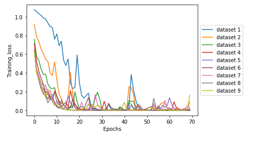

### Creation of datasets
- First, we have created 90000 Mosaic images.
- Labels of every Mosaic image is the class of foreground image present in that image.
- Dataset 'i' will contain 10000 image. Where each image is weighted average of 9 images present in Mosaic image. 
- ( i - 1 ) * 10000  to i * 10000 Mosaic Images were considered to create Dataset 'i'.
- Since we know exactly where the foreground image s present in the Mosaic image, there for Dataset 'i', weight_of_foreground_image = i/9 and weight_of_background_image = (9-i)/8*9. 
- Therefore Average Image in Dataset 'i' = w_fg * I_fg + sum_over_all_background_images( w_bg * I_bg ) 
- Where w_fg = weight_of_foreground_image, w_bg = weight_of_background_image, I_fg = Foreground_Image, I_bg = Background_Image
- w_fg = i / 9 , w_bg= (9-i)/8*9

### Datasets:
- Dataset 1 will contain images which are 1/9 th of every image from mosaic.
- Dataset 2 will contain images which are 2/9 th of I_fg and 7/8*9 th of every I_bg from mosaic.
- Dataset 3 will contain images which are 3/9 th of I_fg and 6/8*9 th of every I_bg from mosaic.
- Dataset 4 will contain images which are 4/9 th of I_fg and 5/8*9 th of every I_bg from mosaic.
- Dataset 5 will contain images which are 5/9 th of I_fg and 4/8*9 th of every I_bg from mosaic.
- Dataset 6 will contain images which are 6/9 th of I_fg and 3/8*9 th of every I_bg from mosaic.
- Dataset 7 will contain images which are 7/9 th of I_fg and 2/8*9 th of every I_bg from mosaic.
- Dataset 8 will contain images which are 8/9 th of I_fg and 1/8*9 th of every I_bg from mosaic.
- Dataset 9 will contain images which are 9/9 th of I_fg and 0 th of every I_bg from mosaic.

### Experiment brief:
- Model ( what network) is trained on Dataset 'i', and Tested on all Dataset 'j', where j is not equal to i, j belongs to 1 to 9.
- We want to see, as the "Where" network perform better, i.e from Dataset 1 to Dataset 9 ( "Where" network learns to focus better),  how the "what" network behaves.

### Architecture of the Model
```python
class Conv_module(nn.Module):
    def __init__(self,inp_ch,f,s,k,pad):
        super(Conv_module,self).__init__()
        self.inp_ch = inp_ch
        self.f = f
        self.s = s 
        self.k = k 
        self.pad = pad
        self.conv = nn.Conv2d(self.inp_ch,self.f,k,stride=s,padding=self.pad)
        self.bn = nn.BatchNorm2d(self.f)
        self.act = nn.ReLU()
    def forward(self,x):
        x = self.conv(x)
        x = self.bn(x)
        x = self.act(x)
        return x
        
class inception_module(nn.Module):
    def __init__(self,inp_ch,f0,f1):
        super(inception_module, self).__init__()
        self.inp_ch = inp_ch
        self.f0 = f0
        self.f1 = f1
        self.conv1 = Conv_module(self.inp_ch,self.f0,1,1,pad=0)
        self.conv3 = Conv_module(self.inp_ch,self.f1,1,3,pad=1)
    def forward(self,x):
        x1 = self.conv1.forward(x)
        x3 = self.conv3.forward(x)
        x = torch.cat((x1,x3),dim=1)
        return x
        
class downsample_module(nn.Module):
    def __init__(self,inp_ch,f):
        super(downsample_module,self).__init__()
        self.inp_ch = inp_ch
        self.f = f
        self.conv = Conv_module(self.inp_ch,self.f,2,3,pad=0)
        self.pool = nn.MaxPool2d(3,stride=2,padding=0)
    def forward(self,x):
        x1 = self.conv(x)
        x2 = self.pool(x)
        x = torch.cat((x1,x2),dim=1)
        return x,x1

class inception_net(nn.Module):
    def __init__(self):
        super(inception_net,self).__init__()
        self.conv1 = Conv_module(3,96,1,3,0)
        self.incept1 = inception_module(96,32,32)
        self.incept2 = inception_module(64,32,48)
        self.downsample1 = downsample_module(80,80)
        self.incept3 = inception_module(160,112,48)
        self.incept4 = inception_module(160,96,64)
        self.incept5 = inception_module(160,80,80)
        self.incept6 = inception_module(160,48,96)
        self.downsample2 = downsample_module(144,96)
        self.incept7 = inception_module(240,176,60)
        self.incept8 = inception_module(236,176,60)
        self.pool = nn.AvgPool2d(5)
        self.linear = nn.Linear(236,10)
    def forward(self,x):
        x = self.conv1.forward(x)
        x = self.incept1.forward(x)
        x = self.incept2.forward(x)
        x,act4 = self.downsample1.forward(x)
        x = self.incept3.forward(x)
        x = self.incept4.forward(x)
        x = self.incept5.forward(x)
        x = self.incept6.forward(x)
        x,act9 = self.downsample2.forward(x)
        x = self.incept7.forward(x)
        x = self.incept8.forward(x)
        x = self.pool(x)
        x = x.view(-1,1*1*236)
        x = self.linear(x) 
        return x
```

#### Weights and Datasets of Experiment can be found here :
>https://drive.google.com/open?id=1j78c9UIE0LJ7hMFCiRPsdWxYdUG9soQR


### Analysis of Accuracy on Training & Testing Data

| train\ test  | test on dataset 1 | test on dataset 2 | test on dataset 3 | test on dataset 4 | test on dataset 5 | test on dataset 6 | test on dataset 7 | test on dataset 8 | test on dataset 9|
|----------|-----|-----|-----|-----|-----|-----|-----|-----|----|
| train on dataset 1      | 99 | 53 | 59 | 64 | 66 | 66 | 66 | 66 | 67 |
| train on dataset 2      | 46 | 99 | 84 | 87 | 88 | 88 | 89 | 89 | 88 |
| train on dataset 3      | 46 | 75 | 100 | 91 | 92 | 92 | 93 | 93 | 92 |     
| train on dataset 4      | 46 | 72 | 87 | 100 | 94 | 95 | 95 | 94 | 95 |
| train on dataset 5      | 45 | 70 | 86 | 92 | 100 | 95 | 95 | 95 | 95 |
| train on dataset 6      | 45 | 70 | 84 | 91 | 94 | 99 | 95 | 95 | 95 |
| train on dataset 7      | 45 | 68 | 83 | 90 | 93 | 94 | 99 | 94 | 94 |
| train on dataset 8      | 46 | 69 | 85 | 91 | 94 | 95 | 96 | 100 | 95 |
| train on dataset 9      | 45 | 68 | 84 | 91 | 94 | 95 | 95 | 95 | 100 |


### Plot of Training loss for all the Datasets :
 
