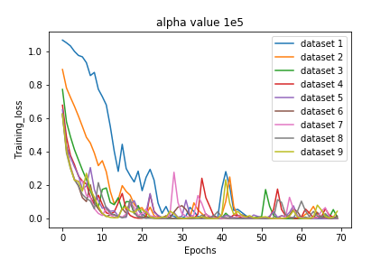

### Focus net output as Dirichlet Distribution

- alpha value = 2

### Creation of datasets
- First, we have created 20000 Mosaic images.
- Labels of every Mosaic image is the class of foreground image present in that image.
- Dataset 'i' will contain 10000 image. Where each image is weighted average of 9 images present in Mosaic image. 
- Dataset 1 to Dataset 9 are made from same 10k Mosaic Images.
- Dataset 10 is made from 10000 to 20000 Mosaic Images which only contains the true Foreground Image present in every Mosaic Image.
- We have modeled the output of Focus network using the Dirichlet distribution with parameters alpha 
- 
- Since we know exactly where the foreground image is present in the Mosaic image, there fore Dataset 'i', weight_of_foreground_image = a_i*alpha and weight_of_background_image = alpha. 
- Therefore Average Image in Dataset 'i' = w_fg * I_fg + sum_over_all_background_images( w_bg * I_bg ) 
- Where w_fg = weight_of_foreground_image, w_bg = weight_of_background_image, I_fg = Foreground_Image, I_bg = Background_Image
- w_fg = a_i*alpha, w_bg= alpha

### Datasets:
- Parameter of distribution for Dataset 1 will be alpha for every image from mosaic.
- Parameter of distribution for Dataset 2 will be 16/7*alpha for foreground image from mosaic and alpha for backgroud image.
- Parameter of distribution for Dataset 3 will be 4*alpha for foreground image from mosaic and alpha for backgroud image.
- Parameter of distribution for Dataset 4 will be 32/5*alpha for foreground image from mosaic and alpha for backgroud image.
- Parameter of distribution for Dataset 5 will be 10*alpha for foreground image from mosaic and alpha for backgroud image.
- Parameter of distribution for Dataset 6 will be 16*alpha for foreground image from mosaic and alpha for backgroud image.
- Parameter of distribution for Dataset 7 will be 28*alpha for foreground image from mosaic and alpha for backgroud image.
- Parameter of distribution for Dataset 8 will be 64*alpha for foreground image from mosaic and alpha for backgroud image.
- Parameter of distribution for Dataset 9 will be 1*alpha for foreground image from mosaic and 0*alpha for backgroud image.
- Dataset 10 will contain true foreground images of Mosaic Images from 10000 to 20000.

### Experiment brief:
- Model ( what network) is trained on Dataset 'i', and Tested on all Dataset 'j', where j is not equal to i, j belongs to 1 to 9.
- We want to see, as the "Where" network perform better, i.e from Dataset 1 to Dataset 9 ( "Where" network learns to focus better),  how the "what" network behaves.
- Mini inception net has been used to train the classification network.

#### Weights and Datasets of Experiment can be found here :
>
### Analysis of Accuracy on Training & Testing Data

| train\ test  | test on dataset 1 | test on dataset 2 | test on dataset 3 | test on dataset 4 | test on dataset 5 | test on dataset 6 | test on dataset 7 | test on dataset 8 | test on dataset 9| test on dataset 10 |
|----------|-----|-----|-----|-----|-----|-----|-----|-----|----|----|
| train dataset 1      | - | 93 | 79 | 73 | 71 | 70 | 69 | 69 | 69 | 68 |
| train dataset 2      | 73 | - | 98 | 95 | 94 | 93 | 92 | 92 | 91 | 88 |
| train dataset 3      | 52 | 91 | - | 99 | 98 | 97 | 97 | 96 | 96 | 92 |     
| train dataset 4      | 48 | 80 | 98 | - | 99 | 99 | 99 | 99 | 99 | 94 |
| train dataset 5      | 47 | 75 | 94 | 99 | - | 100 | 100 | 99 | 99 | 95 |
| train dataset 6      | 45 | 72 | 91 | 98 | 99 | - | 99 | 99 | 99 | 95 |
| train dataset 7      | 46 | 70 | 88 | 97 | 99 |100 | - | 100| 100 | 95 |
| train dataset 8      | 45 | 70 | 88 | 96 | 99 | 99 | 100 | - |100 | 95 |
| train dataset 9      | 45 | 69 | 86 | 94 | 98 | 99 | 99 | 99 | - | 95 |

### Plot of Training loss for all the Datasets :
 
 
### Observations

