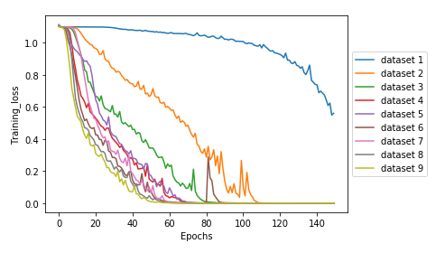

### Creation of datasets
- First, we have created 90000 Mosaic images.
- Labels of every Mosaic image is the class of foreground image present in that image.
- Dataset 'i' will contain 10000 image. Where each image is weighted average of 9 images present in Mosaic image. 
- ( i - 1 ) * 10000  to i * 10000 Mosaic Images were considered to create Dataset 'i'.
- Since we know exactly where the foreground image s present in the Mosaic image, there for Dataset 'i', weight_of_foreground_image = i/9 and weight_of_background_image = (9-i)/8*9. 
- Therefore Average Image in Dataset 'i' = w_fg * I_fg + sum_over_all_background_images( w_bg * I_bg ) 
- Where w_fg = weight_of_foreground_image, w_bg = weight_of_background_image, I_fg = Foreground_Image, I_bg = Background_Image
- w_fg = i / 9 , w_bg= (9-i)/8*9

### Datasets:
- Dataset 1 will contain images which are 1/9 th of every image from mosaic.
- Dataset 2 will contain images which are 2/9 th of I_fg and 7/8*9 th of every I_bg from mosaic.
- Dataset 3 will contain images which are 3/9 th of I_fg and 6/8*9 th of every I_bg from mosaic.
- Dataset 4 will contain images which are 4/9 th of I_fg and 5/8*9 th of every I_bg from mosaic.
- Dataset 5 will contain images which are 5/9 th of I_fg and 4/8*9 th of every I_bg from mosaic.
- Dataset 6 will contain images which are 6/9 th of I_fg and 3/8*9 th of every I_bg from mosaic.
- Dataset 7 will contain images which are 7/9 th of I_fg and 2/8*9 th of every I_bg from mosaic.
- Dataset 8 will contain images which are 8/9 th of I_fg and 1/8*9 th of every I_bg from mosaic.
- Dataset 9 will contain images which are 9/9 th of I_fg and 0 th of every I_bg from mosaic.

### Experiment brief:
- Model ( what network) is trained on Dataset 'i', and Tested on all Dataset 'j', where j is not equal to i, j belongs to 1 to 9.
- We want to see, as the "Where" network perform better, i.e from Dataset 1 to Dataset 9 ( "Where" network learns to focus better),  how the "what" network behaves.

### Architecture of the Model
```python
class Module2(nn.Module):
    def __init__(self):
        super(Module2, self).__init__()
        self.conv1 = nn.Conv2d(3, 6, 5)
        self.pool = nn.MaxPool2d(2, 2)
        self.conv2 = nn.Conv2d(6, 16, 5)
        self.fc1 = nn.Linear(16 * 5 * 5, 120)
        self.fc2 = nn.Linear(120, 84)
        self.fc3 = nn.Linear(84, 10)
        self.fc4 = nn.Linear(10,3)

    def forward(self,z):  #z batch of list of 9 images
        y1 = self.pool(F.relu(self.conv1(z)))
        y1 = self.pool(F.relu(self.conv2(y1)))
        y1 = y1.view(-1, 16 * 5 * 5)
        y1 = F.relu(self.fc1(y1))
        y1 = F.relu(self.fc2(y1))
        y1 = F.relu(self.fc3(y1))
        y1 = self.fc4(y1)
        return y1

```

#### Weights and Datasets of Experiment can be found here :
>https://drive.google.com/open?id=16gvesgnCqwJZlE2yceNc4spm__2o7KNs


### Analysis of Accuracy on Training & Testing Data

| train\ test  | test on dataset 1 | test on dataset 2 | test on dataset 3 | test on dataset 4 | test on dataset 5 | test on dataset 6 | test on dataset 7 | test on dataset 8 | test on dataset 9|
|----------|-----|-----|-----|-----|-----|-----|-----|-----|----|
| train on dataset 1      | 69 | 48 | 51 | 53 | 53 | 53 | 51 | 51 | 50 |
| train on dataset 2      | 43 | 100 | 72 | 74 | 72 | 70 | 67 | 66 | 65 |
| train on dataset 3      | 41 | 62 | 100 | 81 | 79 | 78 | 75 | 73 | 71 |     
| train on dataset 4      | 40 | 57 | 76 | 100 | 87 | 85 | 84 | 83 | 81 |
| train on dataset 5      | 37 | 52 | 72 | 84 | 100 | 88 | 88 | 86 | 84 |
| train on dataset 6      | 37 | 47 | 65 | 80 | 88 | 100 | 90 | 90 | 88 |
| train on dataset 7      | 36 | 43 | 58 | 74 | 84 | 90 | 100 | 91 | 90 |
| train on dataset 8      | 34 | 38 | 52 | 68 | 80 | 87 | 91 | 100 | 92 |
| train on dataset 9      | 34 | 38 | 48 | 61 | 75 | 84 | 89 | 91 | 100 |


### Plot of Training loss for all the Datasets :
 
