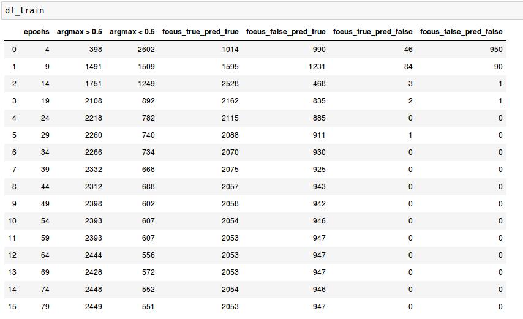
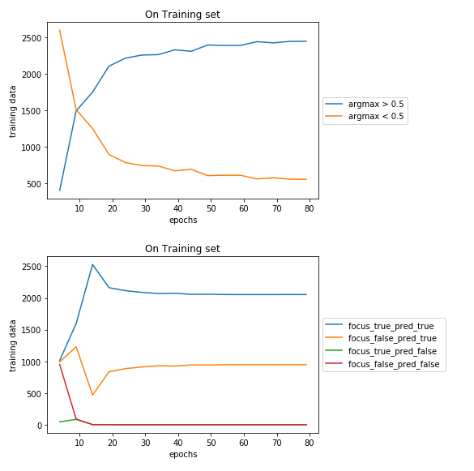
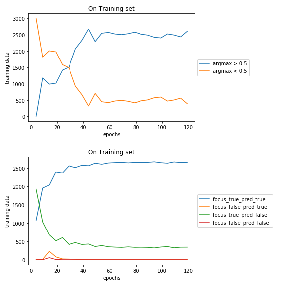

# VISUALISING MOSAIC DATA BY GENERATING 2-DIM SEPARABLE DATA

### Generationtion of 10 Classes Using 2 Dimentional data 
  - We sampled 5000 (500 for every class approx) 2-dim data points from multivariate Normal with 10 different Mean vectors and same Covariance Matrix.
  - Covariance Matrix being the diagonal matrix with enteries [0.1, 0.1].

### Generation of Mosaic Data
- Available Classes = Class 0, Class 1, Class 2, Class 3, Class 4, Class 5, Class 6, Class 7, Class 8
- foreground_classes = Class 0, Class 1, Class 2
- background_classes = Class3, Class 4, Class 5, Class 6, Class 7, Class 8, Class 9
- Every class will have a 2-dim Data Point. 1 data point was chosen at random from any foreground class, and rest 8 data points are chosen from background classes
-  Now we have 9 datapoints which can be arranged randomly in 3 x 3 matrix. In particular Dimention of Matrix will be 3 x 6.
- Following is one of the mosaic image for the sake of visualisation:


### MODEL
  - Model is developed as combination of 2 modules.
  - Module 1 learns "WHERE" the foreground image is present out of 9 images in Mosaic image.
  - Module 2 learns "WHAT" is the class of this foreground image out of those 3 foreground classes.

### Input to Model
- Mosaic image is input to Module 1 i.e "Where Network", and tries to focus on foreground image present in Mosaic Image.
- In Particular, Each image (2 x 1) is input to "Where Network" and hence a 18 x 1 tensor (9 images) is input to "Where Network".
- "Where Network" tries to Focus on Foreground image and returns weighted average of all 9 images.
- This image is now input to "What Network" which finally predicts the Class label of foreground Image.


### Visualising Different types of Generation of Classes through Scatter Plot :
##### Type 1 : Any 2 Classes are linearly separable

##### Type 2 : Any 2 Foreground Classes are linearly separable, No Background Classes can be separable.

##### Type 3 : Set of all Foreground Classes and set of all Background Classes are linearly separable. No 2 Background Classes or Foreground Classes can be separable.

##### Type 4 : Foreground Classes are in Convex Hull of Background Classes. Any 2 Foreground Classes are linearly separable.
 

##### Type 5 : For any classes, we have 2 Gaussian mixtures
 


### Table 1: Analysis of Model on different Parameters
| Experiment No. | Total Epochs | "What" Learning Rate | "Where" Learning Rate | Training Accuracy  | Testing Accuracy |
|----------------|--------------|--------------------|---------------------|--------------------|------------------|
| Type 1 (architecture 1)       | 80          |  0.01               | 0.01                | 1               |1             |
| Type 2 (architecture 1)        | 10          |  0.01               | 0.01                | 1               |1             |
| Type 3 (architecture 1)        | 120         |  0.01               | 0.01                | 0.88            |0.89          |
| Type 4 (architecture 2)         | 164         |  0.01               | 0.01                | 0.99            | 0.99         |
| Type 5 (architecture 1)         | 150        |  0.01               | 0.01                | 0.99            | 0.99         |


### PLOTS For Experiments are as below:

| Dataset Type | Data visualisation | on training | on testing | testing Focus net |
|---------------|-------------------|-------------|------------|------------------|
| Type 1 |   |  |  |  |
| Type 2 |   |  |  |  |
| Type 3 |   |  |  |  |
| Type 4 |   |  |  |  |
| Type 5 |   |  |  |  |

<!-- #### Experiment on TYPE 1: Total Epochs: 80, What lr: 0.01, Where lr: 0.01, train acc: 1, test acc: 1
  <!--  
  
  <!--  
  
    
#### Experiment on TYPE 2: Total Epochs: 10, What lr: 0.01, Where lr: 0.01, train acc: 1, test acc: 1
  <!--  
  
  <!--  
  
    
#### Experiment on TYPE 3: Total Epochs: 120, What lr: 0.01, Where lr: 0.01, train acc: 0.88, test acc: 0.89
  <!--  
   
  <!--  
  
    
#### Experiment on TYPE 4: Total Epochs: 164, What lr: 0.01, Where lr: 0.01, train acc: 0.99, test acc: 0.99
   
   
  
    
#### Experiment on TYPE 5: Total Epochs: 154, What lr: 0.01, Where lr: 0.01, train acc: 0.99, test acc: 0.99
   
   
   -->
  
### Observation tables for Experiment "Testing Focus net with Dataset1-10" :

#### Table 1: for Type 1 Data
|   | test on dataset1 | test on dataset2 | test on dataset3 | test on dataset4 | test on dataset5 | test on dataset6 | test on dataset7 | test on dataset8 | test on dataset9| Train Accuracy |
|----------|-----|-----|-----|-----|-----|-----|-----|-----|----|----|
| train on dataset1      | - | 55 | 59 | 65 | 69 | 68 | 67 | 69 | 68 | 50 |
| train on dataset2      | 48 | - | 62 | 68 | 70 | 68 | 68 | 70 | 63 | 58 |
| train on dataset3      | 45 | 54 | - | 68 | 70 | 70 | 66 | 69 | 65 | 65 |     
| train on dataset4      | 46 | 55 | 63 | - | 71 | 70 | 68 | 69 | 66 | 71 |
| train on dataset5      | 46 | 54 | 63 | 70 | - | 70 | 69 | 70 | 64 | 71 |
| train on dataset6      | 45 | 56 | 63 | 68 | 70 | - | 71 | 69 | 66 | 70 |
| train on dataset7      | 45 | 52 | 56 | 60 | 64 | 68 | - | 70 | 69 | 70 |
| train on dataset8      | 43 | 51 | 57 | 62 | 65 | 67 | 69 | - | 69 | 69 |
| train on dataset9      | 43 | 51 | 58 | 64 | 66 | 68 | 69 | 69 | - | 69 |

#### Table 2: for Type 2 Data
|   | test on dataset1 | test on dataset2 | test on dataset3 | test on dataset4 | test on dataset5 | test on dataset6 | test on dataset7 | test on dataset8 | test on dataset9| Train Accuracy |
|----------|-----|-----|-----|-----|-----|-----|-----|-----|----|----|
| train on dataset1      | - | 70 | 63 | 63 | 63 | 63 | 63 | 63 | 63 | 98 |
| train on dataset2      | 68 | - | 65 | 63 | 63 | 63 | 63 | 63 | 63 | 98 |
| train on dataset3      | 56 | 73 | - | 63 | 63 | 63 | 63 | 63 | 63 | 94 |     
| train on dataset4      | 33 | 66 | 70 | - | 63 | 63 | 63 | 63 | 63 | 83 |
| train on dataset5      | 35 | 57 | 59 | 60 | - | 54 | 62 | 63 | 63 | 69 |
| train on dataset6      | 57 | 62 | 63 | 63 | 63 | - | 70 | 69 | 69 | 78 |
| train on dataset7      | 36 | 57 | 63 | 63 | 63 | 63 | - | 73 | 69 | 89 |
| train on dataset8      | 30 | 33 | 53 | 62 | 63 | 63 | 68 | - | 75 | 94 |
| train on dataset9      | 30 | 30 | 40 | 62 | 63 | 63 | 63 | 73 | - | 97 |

#### Table 3: for Type 3 Data
|   | test on dataset1 | test on dataset2 | test on dataset3 | test on dataset4 | test on dataset5 | test on dataset6 | test on dataset7 | test on dataset8 | test on dataset9| Train Accuracy |
|----------|-----|-----|-----|-----|-----|-----|-----|-----|----|----|
| train on dataset1      | - | 30 | 32 | 32 | 32 | 32 | 32 | 32 | 32 | 45 |
| train on dataset2      | 34 | - | 35 | 34 | 34 | 34 | 34 | 34 | 34 | 52 |
| train on dataset3      | 32 | 34 | - | 36 | 34 | 34 | 34 | 34 | 34 | 58 |     
| train on dataset4      | 32 | 32 | 35 | - | 35 | 34 | 34 | 34 | 34 | 64 |
| train on dataset5      | 32 | 32 | 32 | 37 | - | 36 | 34 | 34 | 34 | 67 |
| train on dataset6      | 32 | 32 | 32 | 32 | 34 | - | 42 | 34 | 34 | 70 |
| train on dataset7      | 32 | 32 | 32 | 32 | 32 | 35 | - | 44 | 35 | 70 |
| train on dataset8      | 32 | 32 | 32 | 32 | 32 | 32 | 37 | - | 47 | 70 |
| train on dataset9      | 32 | 32 | 32 | 32 | 32 | 32 | 32 | 43 | - | 72 |

#### Table 4: for Type 4 Data
|   | test on dataset1 | test on dataset2 | test on dataset3 | test on dataset4 | test on dataset5 | test on dataset6 | test on dataset7 | test on dataset8 | test on dataset9| Train Accuracy |
|----------|-----|-----|-----|-----|-----|-----|-----|-----|----|----|
| train on dataset1      | - | 42 | 48 | 55 | 62 | 66 | 67 | 66 | 62 | 39 |
| train on dataset2      | 38 | - | 45 | 50 | 52 | 55 | 61 | 65 | 66 | 41 |
| train on dataset3      | 38 | 43 | - | 56 | 64 | 67 | 67 | 67 | 67 | 49 |     
| train on dataset4      | 38 | 44 | 49 | - | 66 | 71 | 70 | 67 | 67 | 57 |
| train on dataset5      | 38 | 43 | 50 | 58 | - | 78 | 80 | 73 | 69 | 68 |
| train on dataset6      | 38 | 42 | 49 | 58 | 67 | - | 83 | 78 | 71 | 79 |
| train on dataset7      | 37 | 41 | 47 | 55 | 66 | 76 | - | 94 | 91 | 89 |
| train on dataset8      | 37 | 41 | 47 | 55 | 64 | 75 | 86 | - | 96 | 96 |
| train on dataset9      | 37 | 41 | 46 | 53 | 62 | 69 | 79 | 93 | - | 99 |

#### Table 5: for Type 5 Data
|   | test on dataset1 | test on dataset2 | test on dataset3 | test on dataset4 | test on dataset5 | test on dataset6 | test on dataset7 | test on dataset8 | test on dataset9| Train Accuracy |
|----------|-----|-----|-----|-----|-----|-----|-----|-----|----|----|
| train on dataset1      | - | 37 | 41 | 44 | 46 | 48 | 48 | 49 | 44 | 40 |
| train on dataset2      | 35 | - | 46 | 46 | 52 | 54 | 55 | 54 | 52 | 46 |
| train on dataset3      | 35 | 42 | - | 51 | 53 | 57 | 61 | 61 | 58 | 49 |     
| train on dataset4      | 34 | 39 | 46 | - | 55 | 57 | 59 | 56 | 62 | 53 |
| train on dataset5      | 35 | 38 | 42 | 48 | - | 70 | 69 | 65 | 62 | 63 |
| train on dataset6      | 35 | 37 | 41 | 46 | 58 | - | 86 | 86 | 67 | 76 |
| train on dataset7      | 36 | 38 | 42 | 46 | 54 | 72 | - | 95 | 83 | 90 |
| train on dataset8      | 35 | 38 | 42 | 45 | 49 | 62 | 87 | - | 100 | 98 |
| train on dataset9      | 35 | 38 | 43 | 45 | 46 | 51 | 66 | 97 | - | 100 |

  
  
### Architecture1 used for Type 1,2,3
```python
class Wherenet(nn.Module):
    def __init__(self):
        super(Wherenet,self).__init__()
        self.linear1 = nn.Linear(2,4)
        self.linear2 = nn.Linear(4,8)
        self.linear3 = nn.Linear(8,1)
    def forward(self,z):
        x = torch.zeros([batch,9],dtype=torch.float64)
        y = torch.zeros([batch,2], dtype=torch.float64)
        for i in range(9):
            x[:,i] = self.helper(z[:,2*i:2*i+2])[:,0]
        x = F.softmax(x,dim=1)   # alphas
        x1 = x[:,0]
        for i in range(9):
            x1 = x[:,i]          
            y = y+torch.mul(x1[:,None],z[:,2*i:2*i+2])
        return y , x 

    def helper(self,x):
        x = F.relu(self.linear1(x))
        x = F.relu(self.linear2(x))
        x = self.linear3(x)
        return x


class Whatnet(nn.Module):
    def __init__(self):
        super(Whatnet,self).__init__()
        self.linear1 = nn.Linear(2,4)
        self.linear2 = nn.Linear(4,3)
    def forward(self,x):
        x = F.relu(self.linear1(x))
        x = self.linear2(x)
        return x
where = Wherenet().double()
what = Whatnet().double()
```
### Architecture2 used for Type 4
```python
class Wherenet(nn.Module):
    def __init__(self):
        super(Wherenet,self).__init__()
        self.linear1 = nn.Linear(2,50)
        self.linear2 = nn.Linear(50,50)
        self.linear3 = nn.Linear(50,1)
    def forward(self,z):
        x = torch.zeros([batch,9],dtype=torch.float64)
        y = torch.zeros([batch,2], dtype=torch.float64)
        for i in range(9):
            x[:,i] = self.helper(z[:,2*i:2*i+2])[:,0]
        x = F.softmax(x,dim=1)   # alphas
        x1 = x[:,0]
        for i in range(9):
            x1 = x[:,i]          
            #print()
            y = y+torch.mul(x1[:,None],z[:,2*i:2*i+2])
        return y , x 
    
    def helper(self,x):
        x = F.relu(self.linear1(x))
        x = F.relu(self.linear2(x))
        x = self.linear3(x)
        return x

class Whatnet(nn.Module):
    def __init__(self):
        super(Whatnet,self).__init__()
        self.linear1 = nn.Linear(2,50)
        self.linear2 = nn.Linear(50,3)
    def forward(self,x):
        x = F.relu(self.linear1(x))
        x = self.linear2(x)
        return x
where = Wherenet().double()
what = Whatnet().double()
```

### Weights and CSV (containing focus_vs_pred values every 5 epoch) of above experiments can be found at following Gdrive link :
> https://drive.google.com/open?id=1ysJmEfdmLTnqRaYz6Z6NfXLTrw_QcLLl
