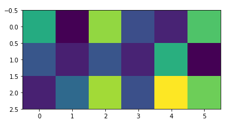
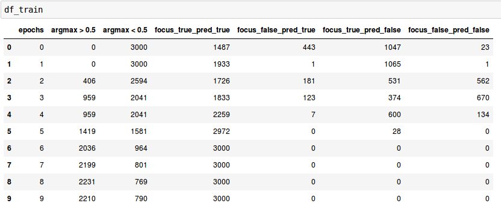
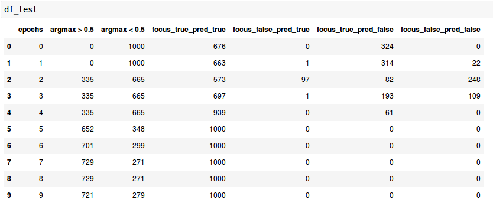
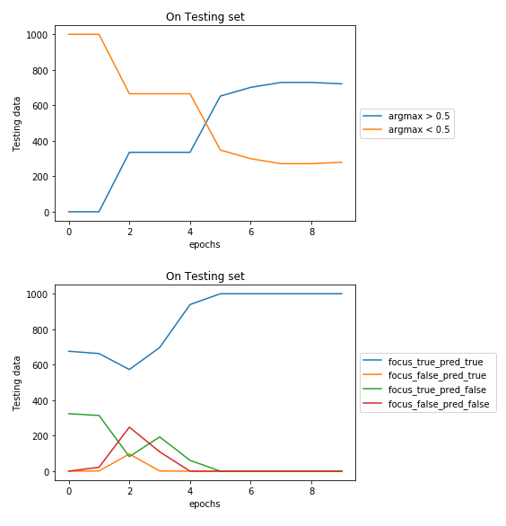

# VISUALISING MOSAIC DATA BY GENERATING 2-DIM SEPARABLE DATA

### Generationtion of 10 Classes Using 2 Dimentional data 
  - We sampled 5000 (500 for every class approx) 2-dim data points from multivariate Normal with 10 different Mean vectors and same Covariance Matrix.
  - Covariance Matrix being the diagonal matrix with enteries [0.1, 0.1].

### Generation of Mosaic Data
- Available Classes = Class 0, Class 1, Class 2, Class 3, Class 4, Class 5, Class 6, Class 7, Class 8
- foreground_classes = Class 0, Class 1, Class 2
- background_classes = Class3, Class 4, Class 5, Class 6, Class 7, Class 8, Class 9
- Every class will have a 2-dim Data Point. 1 data point was chosen at random from any foreground class, and rest 8 data points are chosen from background classes
-  Now we have 9 datapoints which can be arranged randomly in 3 x 3 matrix. In particular Dimention of Matrix will be 3 x 6.
- Following is one of the mosaic image for the sake of visualisation:


### MODEL
  - Model is developed as combination of 2 modules.
  - Module 1 learns "WHERE" the foreground image is present out of 9 images in Mosaic image.
  - Module 2 learns "WHAT" is the class of this foreground image out of those 3 foreground classes.

### Input to Model
- Mosaic image is input to Module 1 i.e "Where Network", and tries to focus on foreground image present in Mosaic Image.
- In Particular, Each image (2 x 1) is input to "Where Network" and hence a 18 x 1 tensor (9 images) is input to "Where Network".
- "Where Network" tries to Focus on Foreground image and returns weighted average of all 9 images.
- This image is now input to "What Network" which finally predicts the Class label of foreground Image.


### Visualising Different types of Generation of Classes through Scatter Plot :
##### Type 1 : Any 2 Classes are linearly separable

##### Type 2 : Any 2 Foreground Classes are linearly separable, No Background Classes can be separable.

##### Type 3 : Set of all Foreground Classes and set of all Background Classes are linearly separable. No 2 Background Classes or Foreground Classes can be separable.

##### Type 4 : Foreground Classes are in Convex Hull of Background Classes. Any 2 Foreground Classes are linearly separable.
 
##### Type 5 : For any classes, we have 2 Gaussian mixtures
 


### Table 1: Analysis of Model on different Parameters
| Experiment No. | Total Epochs | "What" Learning Rate | "Where" Learning Rate | Training Accuracy  | Testing Accuracy |
|----------------|--------------|--------------------|---------------------|--------------------|------------------|
| Type 1 (architecture 1)       | 80          |  0.01               | 0.01                | 1               |1             |
| Type 2 (architecture 1)        | 10          |  0.01               | 0.01                | 1               |1             |
| Type 3 (architecture 1)        | 120         |  0.01               | 0.01                | 0.88            |0.89          |
| Type 4 (architecture 2)         | 164         |  0.01               | 0.01                | 0.99            | 0.99         |
| Type 5 (architecture 1)         | 150        |  0.01               | 0.01                | 0.99            | 0.99         |


### PLOTS For Experiments are as below:

#### Experiment on TYPE 1: Total Epochs: 80, What lr: 0.01, Where lr: 0.01, train acc: 1, test acc: 1
  <!--  -->
  
  <!--  -->
  
#### Experiment on TYPE 2: Total Epochs: 10, What lr: 0.01, Where lr: 0.01, train acc: 1, test acc: 1
  <!--  -->
  
  <!--  -->
  
#### Experiment on TYPE 3: Total Epochs: 120, What lr: 0.01, Where lr: 0.01, train acc: 0.88, test acc: 0.89
  <!--  -->
   
  <!--  -->
  
#### Experiment on TYPE 4: Total Epochs: 164, What lr: 0.01, Where lr: 0.01, train acc: 0.99, test acc: 0.99
   
   
  
  
#### Experiment on TYPE 5: Total Epochs: 154, What lr: 0.01, Where lr: 0.01, train acc: 0.99, test acc: 0.99
   
   


### Architecture1 used for Type 1,2,3
```python
class Wherenet(nn.Module):
    def __init__(self):
        super(Wherenet,self).__init__()
        self.linear1 = nn.Linear(2,4)
        self.linear2 = nn.Linear(4,8)
        self.linear3 = nn.Linear(8,1)
    def forward(self,z):
        x = torch.zeros([batch,9],dtype=torch.float64)
        y = torch.zeros([batch,2], dtype=torch.float64)
        for i in range(9):
            x[:,i] = self.helper(z[:,2*i:2*i+2])[:,0]
        x = F.softmax(x,dim=1)   # alphas
        x1 = x[:,0]
        for i in range(9):
            x1 = x[:,i]          
            y = y+torch.mul(x1[:,None],z[:,2*i:2*i+2])
        return y , x 

    def helper(self,x):
        x = F.relu(self.linear1(x))
        x = F.relu(self.linear2(x))
        x = self.linear3(x)
        return x


class Whatnet(nn.Module):
    def __init__(self):
        super(Whatnet,self).__init__()
        self.linear1 = nn.Linear(2,4)
        self.linear2 = nn.Linear(4,3)
    def forward(self,x):
        x = F.relu(self.linear1(x))
        x = self.linear2(x)
        return x
where = Wherenet().double()
what = Whatnet().double()
```
### Architecture2 used for Type 4
```python
class Wherenet(nn.Module):
    def __init__(self):
        super(Wherenet,self).__init__()
        self.linear1 = nn.Linear(2,50)
        self.linear2 = nn.Linear(50,50)
        self.linear3 = nn.Linear(50,1)
    def forward(self,z):
        x = torch.zeros([batch,9],dtype=torch.float64)
        y = torch.zeros([batch,2], dtype=torch.float64)
        for i in range(9):
            x[:,i] = self.helper(z[:,2*i:2*i+2])[:,0]
        x = F.softmax(x,dim=1)   # alphas
        x1 = x[:,0]
        for i in range(9):
            x1 = x[:,i]          
            #print()
            y = y+torch.mul(x1[:,None],z[:,2*i:2*i+2])
        return y , x 
    
    def helper(self,x):
        x = F.relu(self.linear1(x))
        x = F.relu(self.linear2(x))
        x = self.linear3(x)
        return x

class Whatnet(nn.Module):
    def __init__(self):
        super(Whatnet,self).__init__()
        self.linear1 = nn.Linear(2,50)
        self.linear2 = nn.Linear(50,3)
    def forward(self,x):
        x = F.relu(self.linear1(x))
        x = self.linear2(x)
        return x
where = Wherenet().double()
what = Whatnet().double()
```

### Weights and CSV (containing focus_vs_pred values every 5 epoch) of above experiments can be found at following Gdrive link :
> https://drive.google.com/open?id=1ysJmEfdmLTnqRaYz6Z6NfXLTrw_QcLLl
